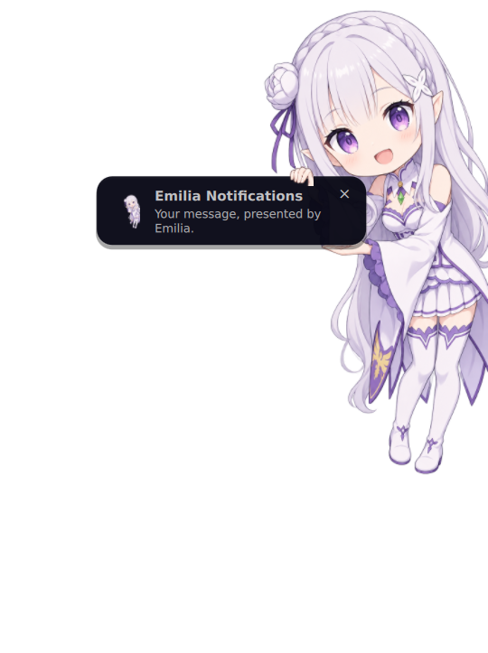

<div align="center">


# Emilia Notifications

### Your notifications have a new presenter.

A playful, fully functional notification daemon for **Quickshell**, **Wayland**, and **Hyprland**.
Emilia slides in from the right edge and presents every notification on a live QML card.

[](https://quickshell.outfoxxed.me/)
[](https://hyprland.org/)
[](#tested-behavior)

</div>

<p align="center">
  
</p>

<p align="center">
  <sub>The character is artwork. The card, text, icon, image, buttons, urgency state, and timeout are all rendered live in QML.</sub>
</p>

---

## Quick start

With Quickshell installed, download the project:

```bash
git clone https://github.com/ilqqy/emilia-notifications.git
cd emilia-notifications
```

Run the daemon from the checkout after stopping your existing notification daemon:

```bash
qs -p shell.qml --no-duplicate
```

Send a notification from another terminal:

```bash
notify-send "Emilia is ready" "Your notifications have a new presenter."
```

For a preview alongside your current daemon, use the [isolated preview](#install).
For automatic startup, follow [the service setup](#use-it-as-your-notification-daemon).

## What makes it different

Most notification daemons stack plain rectangles in a corner. Emilia Notifications treats the popup as one animated composition:

```text
┌──────────────────── dynamic notification card ────────────────────┐  ╭──────╮
│  app · title · body · image · actions                         ×   │  │ Emilia
└────────────────────────────────────────────────────────────────────┘  ╰──────╯
                                                        slides in from the right ←
```

- **One notification at a time** — new notifications wait in a proper queue instead of overlapping.
- **Real freedesktop notifications** — powered by `Quickshell.Services.Notifications.NotificationServer`.
- **Smooth replacement handling** — updates modify the visible or queued notification in place.
- **Focused-monitor placement** — follows the active Hyprland monitor with a safe fallback.
- **Useful interactions** — default action, action buttons, close button, and hover-to-pause.
- **Subtle urgency states** — low, normal, and critical notifications share one coherent design.
- **Wallpaper-aware colors** — reads the existing pywal palette and falls back cleanly when unavailable.
- **Reload safe** — avoids stale notifications and duplicate server state across Quickshell reloads.

## Architecture

The backend and presentation stay separate, so the character artwork or card design can change without rebuilding the notification protocol.

```text
shell.qml
└── notifications/
    ├── NotificationService.qml      freedesktop NotificationServer
    ├── NotificationQueue.qml        ordering and replacement handling
    ├── NotificationQueueEntry.qml   tracked notification lifecycle
    ├── NotificationPopup.qml        monitor placement and slide animation
    ├── NotificationCard.qml         live card content and interaction
    ├── NotificationTimeout.qml      pauseable urgency-aware lifetime
    ├── NotificationConfig.qml       all visual and timing controls
    └── NotificationTheme.qml        pywal colors and fallbacks
```

The visible composition uses three layers:

| Layer | Content |
|:---:|---|
| `z: 0` | Transparent Emilia body artwork |
| `z: 1` | Dynamic QML notification card |
| `z: 2` | Foreground hand/grip overlay |

Only the card accepts pointer input. Transparent and decorative pixels pass clicks through, and the popup never requests keyboard focus.

## Requirements

- [Quickshell](https://quickshell.outfoxxed.me/) with notification and Wayland support
- A Wayland compositor; monitor targeting currently uses Hyprland integration
- `libnotify` for `notify-send` examples
- A user systemd session for the service setup below

## Install

Clone the project into your Quickshell configuration directory:

```bash
git clone https://github.com/ilqqy/emilia-notifications.git \
  ~/.config/quickshell/emilia-notifications
```

You can preview it on an isolated D-Bus session before replacing your current daemon:

```bash
cd ~/.config/quickshell/emilia-notifications

dbus-run-session -- bash -c '
  QT_QPA_PLATFORMTHEME=basic \
  QT_NO_XDG_DESKTOP_PORTAL=1 \
  qs -p shell.qml &
  popup_pid=$!
  trap "kill $popup_pid 2>/dev/null || true" EXIT
  sleep 1
  notify-send -t 5000 "Emilia preview" "The notification card is live QML."
  sleep 7
'
```

### Use it as your notification daemon

Disable any daemon already claiming `org.freedesktop.Notifications`, such as Mako or Dunst. Then create `~/.config/systemd/user/emilia-notifications.service`:

```ini
[Unit]
Description=Emilia Quickshell notification daemon
PartOf=graphical-session.target
After=graphical-session.target
Conflicts=mako.service dunst.service

[Service]
Type=dbus
BusName=org.freedesktop.Notifications
ExecStart=/run/current-system/sw/bin/qs -c emilia-notifications --no-duplicate
Environment=QT_QPA_PLATFORMTHEME=basic
Environment=QT_NO_XDG_DESKTOP_PORTAL=1
Restart=on-failure
RestartSec=1

[Install]
WantedBy=graphical-session.target
```

If `command -v qs` prints a different absolute path, use that path in `ExecStart`.

Enable it immediately:

```bash
systemctl --user disable --now mako.service dunst.service 2>/dev/null || true
systemctl --user daemon-reload
systemctl --user enable --now emilia-notifications.service
notify-send "Emilia is ready" "Your new notification daemon is running."
```

Check that Emilia owns the notification bus:

```bash
systemctl --user status emilia-notifications.service
busctl --user status org.freedesktop.Notifications
```

<details>
<summary><strong>NixOS + Home Manager configuration</strong></summary>

Link the checkout and declare the service in your Home Manager configuration:

```nix
{ config, pkgs, ... }:

{
  services.mako.enable = false;

  xdg.configFile."quickshell/emilia-notifications".source =
    config.lib.file.mkOutOfStoreSymlink "/absolute/path/to/emilia-notifications";

  systemd.user.services.emilia-notifications = {
    Unit = {
      Description = "Emilia Quickshell notification daemon";
      PartOf = [ "hyprland-session.target" ];
      After = [ "hyprland-session.target" ];
      Conflicts = [ "mako.service" "dunst.service" ];
    };

    Service = {
      Type = "dbus";
      BusName = "org.freedesktop.Notifications";
      ExecStart = "${pkgs.quickshell}/bin/qs -c emilia-notifications --no-duplicate";
      Environment = [
        "QT_QPA_PLATFORMTHEME=basic"
        "QT_NO_XDG_DESKTOP_PORTAL=1"
      ];
      Restart = "on-failure";
      RestartSec = 1;
    };

    Install.WantedBy = [ "hyprland-session.target" ];
  };
}
```

Apply the generation, then start the service:

```bash
sudo nixos-rebuild switch --flake /path/to/nixos-config#your-host
systemctl --user restart emilia-notifications.service
```

</details>

## Make it yours

All layout and timing controls live in [`notifications/NotificationConfig.qml`](notifications/NotificationConfig.qml). There are no alignment constants hidden across presentation files.

```qml
property int popupTopMargin: 12
property int popupRightMargin: 0

property real emiliaScale: 0.25
property real emiliaX: 284
property real emiliaY: 0

property real cardX: 118
property real cardY: Math.ceil(gripTopY * maxPoseScale)
property real cardWidth: 300
property real cardHeight: 0
property real cardMinHeight: 62
property real cardMaxHeight: 100

property real handX: emiliaX
property real handY: emiliaY
property real handScale: emiliaScale

property real shownOffsetX: 0
property real hiddenOffsetX: popupWidth + Math.max(0, popupRightMargin)
```

Colors come from `~/.cache/wal/colors.json` when available. Edit [`notifications/NotificationTheme.qml`](notifications/NotificationTheme.qml) to change the palette source, fallbacks, or typography.

### Swap the character art

The included `assets/emilia_side_complete.png` is a transparent, complete character
sprite with both feet visible. It was generated with the built-in imagegen tool:
full-body chibi Emilia leaning from the right, upper hand gripping an imaginary
card, lower palm presenting it, complete feet and transparent padding, no sign or
text. The older cropped artwork is preserved. For a custom two-layer character:

1. Export `emilia_side_body.png` and `emilia_side_hand_overlay.png` on identical transparent canvases.
2. Put the card area between the body and hand layers.
3. Set `emiliaSource`, `handSource`, and `bodySourceRect` in `NotificationConfig.qml`.
4. Tune the scale and position properties in that same file.

When `handSource` is empty, the popup uses a registered crop from the included body art as the foreground grip.
The character scales uniformly with the live card height, keeping the upper grip
and lower palm on its edges. `gripRightX`, `gripTopY`, and `gripBottomY` define
those contact points in source-image pixels; adjust them when changing artwork.
Her right edge stays anchored to the monitor at every size. The card's horizontal
position follows the grip automatically as the message height changes.
Card content uses an image or app icon on the left and a title above the body on
the right. Images take priority over app icons; the column collapses when neither
is available. The app name is used as a fallback when the title is empty.

## Tested behavior

The integration suite starts a real `NotificationServer` on a private D-Bus session with a virtual display. It covers:

- queue order and sequential display
- current and queued replacements
- protocol close and expiry reasons
- hover pause and resume
- low, normal, and critical timeouts
- default and named actions
- long text, images, missing icons, and card bounds
- reload cleanup and post-reload notifications
- clean runtime logs

Run it with:

```bash
bash tests/run.sh
```

On NixOS, if `Xvfb` is not installed globally:

```bash
nix shell nixpkgs#xorg-server --command bash tests/run.sh
```

Quick manual checks:

```bash
notify-send "Test notification" "Emilia side notification is working"
notify-send -u low "Low urgency" "Low urgency test"
notify-send -u normal "Normal urgency" "Normal urgency test"
notify-send -u critical "Critical notification" "Critical notification test"

for i in {1..5}; do
  notify-send "Notification $i" "Queue test $i"
done
```

## Behavior notes

- Default lifetimes are **4.2 s**, **5 s**, and **15 s** for low, normal, and critical notifications.
- A protocol timeout of `0` is persistent and holds the queue until dismissed.
- Positive application timeouts are clamped between **1.5 s** and **30 s**.
- Clicking the card invokes its default action when one exists.
- Extra actions remain accessible in a horizontally scrollable row.
- Replacements update the retained notification without replaying the entry animation.

Quickshell 0.3.0 cannot detect an entirely identical replacement as a content change, so that edge case does not reset the countdown. It also has an upstream issue when an existing action ID changes only its label. See the [upstream notification implementation](https://github.com/quickshell-mirror/quickshell/blob/v0.3.0/src/services/notifications/notification.cpp).

## Troubleshooting

If notifications do not appear, another daemon probably owns the D-Bus name:

```bash
busctl --user status org.freedesktop.Notifications
systemctl --user --type=service | grep -E 'mako|dunst|swaync|notification'
```

For runtime logs:

```bash
journalctl --user -u emilia-notifications.service -b -f
```

After editing QML, restart the managed instance:

```bash
systemctl --user restart emilia-notifications.service
```

---

<div align="center">

Built with QML, too much purple, and excellent taste by **[ilqqy](https://github.com/ilqqy)**.

<sub>Emilia is a character from Re:Zero. This is an unofficial fan project and is not affiliated with the original rights holders.</sub>

</div>
